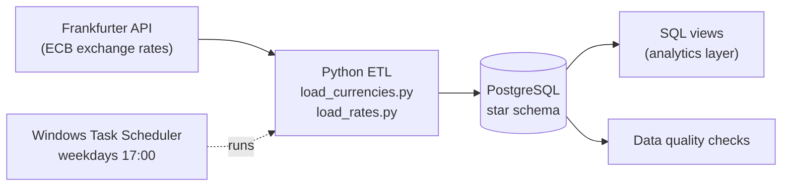

# FX Rates Data Pipeline

An automated end-to-end ETL pipeline that collects daily foreign exchange reference rates published by the European Central Bank (ECB), loads 25+ years of history into a PostgreSQL data warehouse modeled as a star schema, and exposes the data through an analytical SQL layer with automated data quality checks.

The pipeline runs automatically every weekday, loads only new data (incremental load), and can be safely re-run at any time without creating duplicates.

## Motivation

As an active forex trader, I wanted to build the data infrastructure behind the kind of data I use myself: a reliable, automatically updated historical database of exchange rates that can answer analytical questions such as monthly averages, daily changes and the largest moves in a currency's history.

## Architecture



## Tech Stack

- **Python** – ETL logic (`requests`, `psycopg2`, `python-dotenv`)
- **PostgreSQL** – data warehouse
- **SQL** – data modeling, analytical views, window functions, data quality checks
- **Windows Task Scheduler** – daily scheduling
- **Git / GitHub** – version control

## Data Source

[Frankfurter API](https://frankfurter.dev) – a free, open-source API for ECB reference exchange rates. Rates are published once per working day (around 16:00 CET), use EUR as the base currency and are available from 4 January 1999.

> Note: ECB rates are daily **reference** rates (one value per day), not tradable market quotes. They are well suited for historical and trend analysis.

## Data Model

The warehouse uses a **star schema**: one fact table with the measurements (exchange rates) surrounded by dimension tables with descriptive data. This structure keeps the fact table compact and makes analytical queries simple and fast.

| Table | Type | Description |
|---|---|---|
| `fact_exchange_rate` | Fact | One row per date, base currency and target currency, with the exchange rate |
| `dim_currency` | Dimension | Currency codes (ISO 4217) and full names |
| `dim_date` | Dimension | Calendar from 1999 to 2030 with year, quarter, month, day of week and weekend flag |

`fact_exchange_rate` has a unique constraint on `(date_id, base_currency_id, target_currency_id)`, which guarantees there are no duplicate rates.

## How the Pipeline Works

`run_pipeline.py` runs three steps in order. If any step fails, the pipeline stops and exits with an error code.

1. **Load currencies** (`load_currencies.py`) – fetches the list of currencies and upserts it into `dim_currency`.
2. **Load exchange rates** (`load_rates.py`) – incremental load:
   - reads the latest date already loaded (the **watermark**)
   - on the first run (empty table) it loads the full history from 1999
   - on later runs it loads only dates after the watermark, up to today
   - data is fetched **year by year** to keep API responses small
   - rows are written in bulk with `execute_values` and upserted on the unique key
3. **Data quality checks** (`data_quality_checks.py`) – the pipeline fails if any check fails:

| Check | What it detects |
|---|---|
| `no_non_positive_rates` | Rates equal to or below zero |
| `no_duplicate_rates` | Duplicate rows for the same date and currency pair |
| `data_is_fresh` | Latest loaded date older than 5 days (or an empty table) – the pipeline has silently stopped |
| `no_large_date_gaps` | Gaps longer than 5 days between loaded dates – missing history |

## Analytical Views

All views are built on top of `vw_exchange_rates`, so the joins are written only once.

| View | Description |
|---|---|
| `vw_exchange_rates` | Flat, analyst-friendly view joining the fact table with both dimensions |
| `vw_latest_rates` | Rates for the most recent available date |
| `vw_monthly_rates` | Monthly average, minimum and maximum rate per currency |
| `vw_daily_change` | Daily rate, previous day's rate (`LAG` window function) and percentage change |

Example queries:

```sql
-- Monthly EUR/USD statistics for 2025
SELECT * FROM vw_monthly_rates
WHERE target_currency = 'USD' AND year = 2025
ORDER BY month;

-- Five largest single-day moves of the Japanese yen
SELECT full_date, rate, pct_change
FROM vw_daily_change
WHERE target_currency = 'JPY'
ORDER BY ABS(pct_change) DESC NULLS LAST
LIMIT 5;
```

## Key Design Decisions

- **Idempotent loads** – all inserts use `INSERT ... ON CONFLICT DO UPDATE` (upsert), so the pipeline can be re-run any number of times without creating duplicates.
- **Incremental loading with a watermark** – only missing dates are loaded, so daily runs are fast, and if the pipeline misses a few days (e.g. the computer was off), the next run automatically catches up.
- **Exact decimal arithmetic** – rates are stored as `NUMERIC(18,6)` and parsed in Python as `Decimal` instead of `float`, avoiding rounding errors in financial data.
- **No silent data loss** – rows with currencies that are missing from `dim_currency` (e.g. legacy currencies replaced by the euro) are skipped, but counted and reported as a warning.
- **Fail loudly** – API errors raise immediately (`raise_for_status`), database writes run in transactions (all or nothing), and failed quality checks stop the pipeline with a non-zero exit code.
- **Reusable SQL layer** – joins live in one base view, and all other views are built on top of it.
- **Secrets outside the code** – database credentials are stored in a git-ignored `.env` file.

## How to Run

**Prerequisites:** Python 3.10+, PostgreSQL

1. Clone the repository:
   ```
   git clone https://github.com/Bab1cc/data-engineering-project-1.git
   cd  D:\data-engineering-project-1>
   ```
2. Create a database (e.g. `projekat1`) and run the SQL scripts in this order:
   ```
   sql/create_tables.sql
   sql/views.sql
   ```
3. Install Python dependencies:
   ```
   pip install -r requirements.txt
   ```
4. Copy `.env.example` to `.env` and fill in your database connection details.
5. Run the pipeline:
   ```
   python src/run_pipeline.py
   ```
   The first run loads the full history since 1999 and takes a little longer. Every later run loads only new data.

**Scheduling (Windows):** `run_pipeline.bat` starts PostgreSQL if it is not running, runs the pipeline and appends the output to `logs/pipeline.log`. It is scheduled in Windows Task Scheduler to run every weekday at 17:00, after the ECB publishes new rates. Paths in the `.bat` file need to be adjusted to your machine.

## Project Structure

```
├── sql/
│   ├── create_tables.sql        # star schema + dim_date population
│   └── views.sql                # analytical views
├── src/
│   ├── db.py                    # database connection
│   ├── load_currencies.py       # ETL for dim_currency
│   ├── load_rates.py            # incremental ETL for fact_exchange_rate
│   ├── data_quality_checks.py   # automated data quality checks
│   └── run_pipeline.py          # runs the full pipeline in order
├── logs/                        # pipeline logs (git-ignored)
├── .env.example                 # template for database settings
├── requirements.txt
└── run_pipeline.bat             # entry point for Task Scheduler
```

## Future Improvements

- Orchestrate the pipeline with **Apache Airflow** running in **Docker**, with task dependencies and retries
- Build a **dashboard** (Streamlit or Power BI) on top of the analytical views
- Replace `print` with Python's `logging` module and add log rotation
- Add unit tests for the transform functions and CI with GitHub Actions
- Add cross-rate views (e.g. USD/JPY derived from EUR-based rates), moving averages and volatility metrics
- Deploy the database and pipeline to the cloud so it does not depend on a local machine
